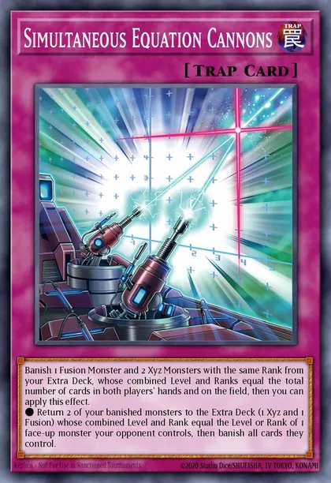

<a id="readme-top"></a>


<br />
<div align="center">
  <a href="https://github.com/avogatro/simultaneous-equation-cannons-helper">
    
  </a>

  <h3 align="center">Simultaneous Equation Cannons Helper</h3>

  <p align="center">
    A KivyMD Python UI for playing the Card <b>Simultaneous Equation Cannons</b> in the Game of <b>Yo-Gi-Oh</b>
    <br />
    <a href="https://github.com/avogatro/simultaneous-equation-cannons-helper/README.md"><strong>Explore the docs »</strong></a>
    <br />
    <br />
    <a href="https://www.youtube.com/watch?v=ToOtjNXVsYU">View Demo</a>
    .
    <a href="https://github.com/avogatro/simultaneous-equation-cannons-helper/releases/">Release: Windows Binary</a>
    ·
    <a href="https://github.com/avogatro/simultaneous-equation-cannons-helper/issues">Report Bug</a>
    ·
    <a href="https://github.com/avogatro/simultaneous-equation-cannons-helper/issues">Request Feature</a>
  </p>
</div>


<!-- TABLE OF CONTENTS -->
<details>
  <summary>Table of Contents</summary>
  <ol>
    <li>
      <a href="#about-the-project">About The Project</a>
      <ul>
        <li><a href="#built-with">Built With</a></li>
      </ul>
    </li>
    <li>
      <a href="#getting-started">Getting Started</a>
      <ul>
        <li><a href="#prerequisites">Prerequisites</a></li>
        <li><a href="#installation">Installation</a></li>
      </ul>
    </li>
    <li><a href="#usage">Usage</a></li>
    <li><a href="#roadmap">Roadmap</a></li>
    <li><a href="#contributing">Contributing</a></li>
    <li><a href="#license">License</a></li>
    <li><a href="#contact">Contact</a></li>
    <li><a href="#acknowledgments">Acknowledgments</a></li>
  </ol>
</details>


<!-- ABOUT THE PROJECT -->
## About The Project

I like to play this card, but it is very complicated to play for many hours.
That is why I want to use this program to help me to play when I still know how to count cards.


<p align="right">(<a href="#readme-top">back to top</a>)</p>


### Built With

* [KivyMD](https://github.com/kivymd/KivyMD)
* [Kivy](https://github.com/kivy/)


<p align="right">(<a href="#readme-top">back to top</a>)</p>


<!-- GETTING STARTED -->
## Getting Started

### Installation
#### Use Python Interpreter:
##### Hint: if u only use console and not the UI, u don't need anything else beside python3
##### Hint: if "pip" don't exist use "pip3"

- git clone this project
- install Python 3 
- for windows: edit env variables to add python path to path 
- cd <project_folder>
- pip install https://github.com/kivymd/KivyMD/archive/master.zip 
- pip install -r requirements.txt
- python.exe main.py

#### Use Windows Release
 - Download latest Single-File <a href="https://github.com/avogatro/simultaneous-equation-cannons-helper/releases/">Release / Windows Executable</a>
 - It is not an Executable signed by Microsoft, that is why Windows Defender will show warning
 - Allow your browser to download
 - on execution click on "Run Anyway"

<p align="right">(<a href="#readme-top">back to top</a>)</p>

### Usage


#### Normal, With No Banished Extra Deck Monster
 - Under "Extra Deck" define level/rank u want to use for SEC
 - Go back to Main
 - The app shows every Level of monster u can match and the required total cards in both player's hand and on both player's board
 - Click on each total number to see what level/rank u have to banish


<p align="right">(<a href="#readme-top">back to top</a>)</p>


#### On Second or third SEC
 - there are previously banished monster in your banished zone
 - define them under "Banished Zone"
 - Go back to Main
 - Click on each total number to see what level/rank u have to banish


#### Use only Python in console, no UI
 - open console, go to project folder
 - start python3 interactive console

 ```python
from Model.simultaneous_equation_cannons_state import * # import module

sec = SimultaneousEquationCannonsState([2, 3, 4, 5, 6], [2, 3, 4, 5, 6]) # setup extra deck
sec.set_banish_zone_monster_level(fusion_levels=[], xyz_ranks=[4]) # setup previously banish xyz or fusion monsters
sec.print_value_table() # ouput
sec.reset_banish_zone_monster_level() # reset banish zone
```

##### Output
```
fusion_level    [2, 3, 4, 5, 6]
xyz_rank        [2, 3, 4, 5, 6]
banished fusion_level   []
banished xyz_rank       [4]
Monster Lvl/Rank to Match: 4     Possible Total Cards: [6]
Monster Lvl/Rank to Match: 5     Possible Total Cards: [7, 8]
Monster Lvl/Rank to Match: 6     Possible Total Cards: [6, 8, 9, 12, 14]
Monster Lvl/Rank to Match: 7     Possible Total Cards: [7, 9, 10, 12, 13, 15]
Monster Lvl/Rank to Match: 8     Possible Total Cards: [8, 10, 11, 13, 14, 16]
Monster Lvl/Rank to Match: 9     Possible Total Cards: [9, 11, 12, 14, 15, 17]
Monster Lvl/Rank to Match: 10    Possible Total Cards: [10, 12, 15, 16, 18]
Monster Lvl/Rank to Match: 11    Possible Total Cards: [16, 17]
Monster Lvl/Rank to Match: 12    Possible Total Cards: [18]
```

<!-- CONTRIBUTING -->
## Contributing

Contributions are what make the open source community such an amazing place to learn, inspire, and create. Any contributions you make are **greatly appreciated**.

If you have a suggestion that would make this better, please fork the repo and create a pull request. You can also simply open an issue with the tag "enhancement".
Don't forget to give the project a star! Thanks again!


<p align="right">(<a href="#readme-top">back to top</a>)</p>


<!-- LICENSE -->
## License

Distributed under the MIT License. See `LICENSE.txt` for more information.

<p align="right">(<a href="#readme-top">back to top</a>)</p>


<!-- CONTACT -->
## Contact

Project Link: [https://github.com/avogatro/simultaneous-equation-cannons-helper](https://github.com/avogatro/simultaneous-equation-cannons-helper)

<p align="right">(<a href="#readme-top">back to top</a>)</p>


<!-- ACKNOWLEDGMENTS -->
## Acknowledgments


<p align="right">(<a href="#readme-top">back to top</a>)</p>


