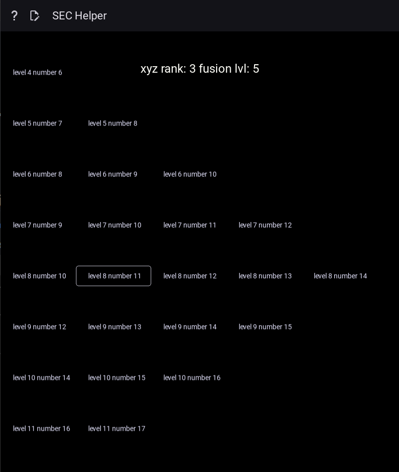

 

  

  <h3 align="center">Simultaneous Equation Cannons Helper</h3>

  

    A KivyMD Python UI for playing the Card <b>Simultaneous Equation Cannons</b> in the Game of <b>Yo-Gi-Oh</b>
     
    <a href="https://github.com/avogatro/simultaneous-equation-cannons-helper/README.md"><strong>Explore the docs »</strong></a>
     
     
    <a href="https://youtube.com/">View Demo</a>
    ·
    <a href="https://github.com/avogatro/simultaneous-equation-cannons-helper/issues">Report Bug</a>
    ·
    <a href="https://github.com/avogatro/simultaneous-equation-cannons-helper/issues">Request Feature</a>
  

<!-- TABLE OF CONTENTS -->

  
Table of Contents

  <ol>
    <li>
      <a href="#about-the-project">About The Project</a>
      <ul>
        <li><a href="#built-with">Built With</a></li>
      </ul>
    </li>
    <li>
      <a href="#getting-started">Getting Started</a>
      <ul>
        <li><a href="#prerequisites">Prerequisites</a></li>
        <li><a href="#installation">Installation</a></li>
      </ul>
    </li>
    <li><a href="#usage">Usage</a></li>
    <li><a href="#roadmap">Roadmap</a></li>
    <li><a href="#contributing">Contributing</a></li>
    <li><a href="#license">License</a></li>
    <li><a href="#contact">Contact</a></li>
    <li><a href="#acknowledgments">Acknowledgments</a></li>
  </ol>

<!-- ABOUT THE PROJECT -->
## About The Project

I like to play this card, but it is very complicated to play for many hours.
That is why I want to use this program to help me to play when I still know how to count cards.

(<a href="#readme-top">back to top</a>)

### Built With

* [KivyMD](https://github.com/kivymd/KivyMD)
* [Kivy](https://github.com/kivy/)

(<a href="#readme-top">back to top</a>)

<!-- GETTING STARTED -->
## Getting Started

- git clone this project
- install python 3
- for windows: edit env variables to add python path 
- cd <project_folder>
- pip install -r requirements.txt
- python.exe main.py

(<a href="#readme-top">back to top</a>)

<!-- CONTRIBUTING -->
## Contributing

Contributions are what make the open source community such an amazing place to learn, inspire, and create. Any contributions you make are **greatly appreciated**.

If you have a suggestion that would make this better, please fork the repo and create a pull request. You can also simply open an issue with the tag "enhancement".
Don't forget to give the project a star! Thanks again!

(<a href="#readme-top">back to top</a>)

<!-- LICENSE -->
## License

Distributed under the MIT License. See `LICENSE.txt` for more information.

(<a href="#readme-top">back to top</a>)

<!-- CONTACT -->
## Contact

Project Link: [https://github.com/avogatro/simultaneous-equation-cannons-helper](https://github.com/avogatro/simultaneous-equation-cannons-helper)

(<a href="#readme-top">back to top</a>)

<!-- ACKNOWLEDGMENTS -->
## Acknowledgments

(<a href="#readme-top">back to top</a>)

